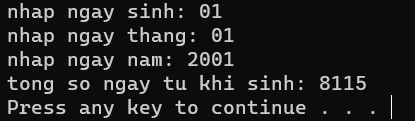

# C++ - Tính số ngày tuổi 


 

## Tác giả

| STT |    MSSV    | Họ và tên             |
| :-: | :--------: | --------------------- |
|  1 | 3119410439 | Minh Hiếu Calan Tog   |


## Yêu Cầu:

- Xử lý bài toán tính số ngày tuổi bằng c++ <br/>


## Hướng dẫn cài đặt

```
 Chạy file "tinh_ngay_tuoi.exe" và nhập các số liệu cần thiết.
```


## Giao diện chạy của chương trình:



